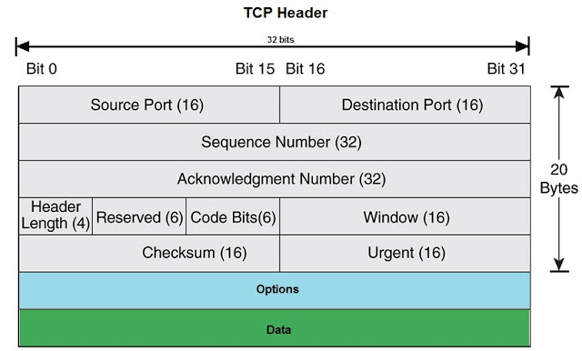
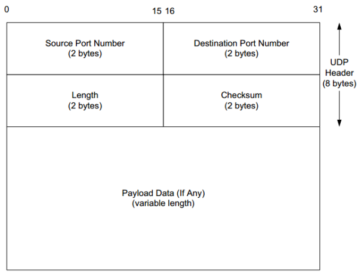

# Documentation of project 1 of IPK 2024/2025 (variant Omega)
## Author: Patrik Tomaško (xtomasp00)
## Brno University of Technology

# ipk-l4-scan

The goal of this project was to make a program that is capable of scanning ports and finding out their status via either UDP or TCP. The program is also capable of printing out all the available network interfaces that the user can choose. The user can specify the protocol being used, ports to be scanned, interface via the scanning will take place, target IP/domain and optionally also the timeout time after which the program will preform a certain action depending on the protocol.

## Theory necessary to understand the functionality of the application
### IP address
IP address is a number that identifies a network interface within a computer network. There are two main types IPv4 and IPv6. 
IPv4 is the dominantly used one. It has 32 bites, which can be divided into four bytes (1 byte = 8 bits) and written sepparately converted to the decimal system separated by dots. That is the usual format in which IPv4 addresses appear for example 127.0.0.1, 8.8.8.8, ... 
IPv6 addresses were invented as a solutionto the insufficient number of the available IPv4 addresses, which ran out. An IPv6 address contains 128 bytes which are commonly divided into 8 groups of 16 bits. Each group is represented as a four digit hexadecimal nuber and they are divided by colons. For example: 2001:0db8:85a3:0000:8a2e:0370:7334:0000. Often times many of the groups are all zeros, thus to make the addresses more readeble, the groups of zeros next to each other are usually turned into a double colon. For example: 2001:0db8:85a3::8a2e:0370:7334.

### Packet
A packet is a small unit of data that is transmitted over computer networks. When transmitting data over networks it is better to break the data down into smaller pieces that are easier for the network infrastructure to manage. That is the reason why packets exist. They usually hold the data they are transmitting and also data necessary for the packet to be sent to it's destination.

Components of a packet:
1. Header - Contains routing information like sender and reciever IP addresses and sender and reciever ports.
2. Payload - The data that is transmitted via the packets.
3. Footer/Checksum - Packets often include a footer that holds a certain information like checksum that is used to verify that the packet didn't get deformed on it's way through the network.

 ### Ports
 Ports are logical communication endpoints used by protocols like UDP and TCP to distinguish different types of traffic on the same IP address. It is used to have the communication organised in a certain way and also for security reasons. Some ports have a protocol that is usually associated with them like for example: HTTP -> 80, SSH -> 20, ... Each of the ports can have a certain status, for our purposed we need to know that a port can be either open, closed or filtered. Open means that the port is ready to accept and react to certain packets being sent to it. Closed means that the port is not willing to communicat and filtered means that the port is not directly accessible, often due to a firewall or some other security mechanism blocking traffic to that port, preventing any communication from taking place.

 ### TCP
 TCP (Transmition control protocol) is a communication protocol used in computer networks. It ensures a reliable communication. When two devices communicate via TCP they first establish a connection between each other and maintain this connection as long as they communicate between each other. They send packets over this connection and when a packet does not arrive or is deformed during transmitting the packet will get retransmitted. This ensure that the communication is reliable. TCP is used for thing that need reliability like chatting for example.

 ### UDP
 UDP (User datagram protocol) is a communication protocol used in computer networks. Unlike TPC it does not establish any connection before sending packets. UDP is generally unreliable and mostly used for transmitting large ammounts of data, where it is not important wether some packets get lost. UDP is used for thing like streaming, playing online video games, ...

 ### Domains
 In networking and the internet, domains are human-readable addresses used to identify a specific website, server, or a network resource. Domains are a part of the Domain Name System (DNS) that translates domains into IP addresses.

 ## Implementation details

### TCP construction and scanning

#### TCP Header construction
The first step of scanning via TCP is creating a packet. Fortunatelly we won't have to worry about any payload or the IP header since we aren't sending any data and the IP header is created by the kernel. What we will have to worry about is the TCP header which looks like this.

Next to each of the elements of the TCP header is a number of bits. Fortunatelly not all the elements have to be filled out with a specific value. There are though certain elements that we have to fill out for the TCP packet to function properly, these are: 
- source port 
- destination port (scanned port)
- sequence number (used to match the TCP packet and see the sequence of the communication)
- flags (in our case the flags will determine that status of the port)
- offset
- window
- checksum (it has to be calculated correctly otherwise the packet will be considered deformed and thrown away) 
Underneath here you can see the part of my code that implements the creation of the TCP header. All the functions and utilities for the creation of TCP and UDP packets are localted in the `packet_buildre.c` file.

<pre>        memset(header, 0, sizeof(struct tcphdr));
        
        header->th_seq = htonl(rand());
        header->th_flags = TH_SYN;
        header->th_off = 5;
        header->th_win = htons(65535);
        header->th_sport = htons(SOURCE_PORT);
        header->th_dport = htons(destination_port);
        header->th_sum = 0; //temporary
        
        uint16_t sum = tcp_checksum(source_ip, target_ip, header, sizeof(struct tcphdr), ipv6_mode);
        header->th_sum = sum; </pre>

Here you can see how each of the elements I mentioned are being assigned a certain value. The `htons` function here converts the values to the from the host byte order to network byte order. The byte order refers to the endianness of the data. The endianness describes the way the information is represented in the memory. Little endian means that the least significant byte is first and the most is last (host byte order) and big endian means that the least significant byte is last and the most significant first (network byte order).
Probably the most complicated part of the TCP header generation is the checksum, which requires construction of a pseudo header to calculate it. The calculation of the checksum is described lower in the documentation.

#### TCP scanning
There are three statuses that we will be checking for when scanning via TCP.
- Open
- Closed
- Filtered

In the case of TCP we have a bit more assurance of what the status actually is, because the protocol itself is much more reliable. We will be initializing a TCP handshake with the target and his response will determine the status. We will start by sending a TCP packet with the flag SYN to initialize this handshake and waiting for the response which will also be a TCP packet.

##### Open
If we will recieve a TCP packet response with the flags SYN and ACK, it means that the target is ready for the handshake and the port is open. We will not finish this handshake and simply leave it and print out that the port is open.

##### Closed
If we will recieve a TCP packet response with the RST flag it means that the port is closed.

##### Filtered
If the TCP response does not come in the defined timeout time (either defined by the user or 5 seconds by default) we will attempt to send another handshake initialisation packet and if even the second packet times out we will declare the packet as closed.

Here's the part of the code in `port_analyzer.c` that implements this scanning logic of the ports using TCP and IPV4.

<pre>
while(verify_filtered < 2){ //trying until two timeouts

        construct_tcp_header(&target, (uint16_t) index, &tcp_header, false, &source_ip);
        
        ssize_t bytes_sent = sendto(raw_socket, &tcp_header, sizeof(tcp_header), 0, (struct sockaddr*)&target_wrapper, sizeof(target_wrapper));

        if (bytes_sent == -1) {

                fprintf(stderr, "Error: Failed to send the packet. Didn't you try to analyze ports outside localhost via lo?\n");
                close(raw_socket);
                return false;

        }

        fd_set read_content;

        struct timeval timeout_struct, start_time, recieve_time;

        int elapsed_time = 0;

        gettimeofday(&start_time, NULL);

        int matching_ips = 1; //used to determine and await a packet coming from the correct IP address

        while(matching_ips == 1){

                gettimeofday(&recieve_time, NULL);

                elapsed_time = (recieve_time.tv_sec - start_time.tv_sec) * 1000 + (recieve_time.tv_usec - start_time.tv_usec) / 1000;

                int remaining_time = timeout - elapsed_time; //updating the time in case of recieving a packet that is not from the scanning target

                if(remaining_time < 0)
                        remaining_time = 0;

                int waiter = 0;

                if(remaining_time != 0){

                        timeout_struct.tv_sec = remaining_time / 1000;
                        timeout_struct.tv_usec = (remaining_time % 1000) * 1000;

                        FD_ZERO(&read_content);
                        FD_SET(raw_socket, &read_content);

                        waiter = select(raw_socket + 1, &read_content, NULL, NULL, &timeout_struct);

                }

                if(waiter < 0){

                        printf("Error: Select() failed.\n");
                        close(raw_socket);
                        return false;

                }

                if(waiter == 0){

                        matching_ips = 0;

                        verify_filtered++;

                        if(verify_filtered == 2)  //timed out two times
                                printf("%s %d tcp filtered\n", inet_ntoa(target_wrapper.sin_addr), index);

                }else{

                        struct sockaddr_in sender;
                        socklen_t sender_length = sizeof(sender);
                        char buffer[1024];

                        ssize_t recieved = recvfrom(raw_socket, buffer, sizeof(buffer), 0, (struct sockaddr *)&sender, &sender_length);

                        matching_ips = analyze_ips(buffer, target); //checking wether the ips match

                        if(matching_ips == 1) //skip if not
                                continue;

                        if(recieved > 0){

                                int state = analyze_tcp_response(buffer,false, tcp_header.th_seq);

                                if(state == -1){

                                        printf("%s %d tcp open\n", inet_ntoa(target_wrapper.sin_addr), index);
                                        verify_filtered = 2;

                                }else if (state == 1){

                                        printf("%s %d tcp closed\n", inet_ntoa(target_wrapper.sin_addr), index);
                                        verify_filtered = 2;

                                }else if (state == 2){

                                        matching_ips = 1;
                                        continue;

                                }

                        }

                        break;

                }

        }

}
</pre>

The code consists of two main while loops, the first while loop that has `verify_filter` variable in it's condition is the loop that will send the packet again in case the packet times out. 

The inner loop with the `matching_ips` variable in it's condition is used to recieve the correct packet, since the socket via which we are recieving the incoming packets can recieve a packet that is not from the target IP address. In such case we will throw the caught packet away, the new time to wait (timeout - time elapsed) will get calculated and another select (the function that waits for the response) will get called with the updated timeout value. To compare the IP addresses the function `analyze_ips` is used.

If the recieved packet is from the scanning target, the response is sent to the `analyze_tcp_response` which determines wether the TCP packet is even a response to our handshake initialisation (sequence number match), and then analyzes the flags and returns wether the port is open or closed.

### UDP construction and scanning
The first step of scanning via UDP is also creating a packet. As with the TCP packet the only thing we have to create and fill out is the UDP header which is in the picture below.

Underneath each of the elements of the UDP header is a number of bytes. We will have to fill out all of the parts of the header which are: 
- source port 
- destination port (scanned port)
- length
- checksum (it has to be calculated correctly otherwise the packet will be considered deformed and thrown away) 
Underneath here you can see the part of my code that implements the creation of the UDP header. All the functions and utilities for the creation of TCP and UDP packets are localted in the `packet_buildre.c` file.

<pre>        memset(header, 0, sizeof(struct udphdr));
        
        header->uh_ulen = htons(sizeof(struct udphdr));
        header->uh_sport = htons(SOURCE_PORT);
        header->uh_dport = htons(destination_port);
        header->uh_sum = 0; //temporary
        
        uint16_t checksum = udp_checksum(source_ip, target_ip, header, sizeof(struct udphdr), ipv6_mode);
        header->uh_sum = checksum; </pre>

Here you can see how each of the elements I mentioned are being assigned a certain value. The `htons` function is once again used to convert values from host byte order to the network byte order. Once again the checksum calculation is neede which is described lower in the documentation.

#### UDP scanning
There are two statuses that we will be checking for when scanning via UDP.
- Open
- Closed

In the case of UDP we don't really have a reliable way to tell wether the port is open or filtered. The only thing we can tell for sure is wether the port is closed. If the port is closed we will recieve an ICMP/ICMPv6 packet with the code 3 and type 3 (in the case of IPV4) or code 4 and type 1 (in the case of IPV6).

Here's the part of the code in `port_analyzer.c` that implements this scanning logic of the ports using UDP and IPV4.

<pre>
struct udphdr udp_header;

construct_udp_header(&target, (uint16_t) index, &udp_header, false, &source_ip);

ssize_t bytes_sent = sendto(raw_socket_send, &udp_header, sizeof(udp_header), 0, (struct sockaddr*)&target_wrapper, sizeof(target_wrapper));

if (bytes_sent == -1) 
        fprintf(stderr, "Error: Failed to send the packet.\n");

fd_set read_content;
FD_ZERO(&read_content);
FD_SET(raw_socket_recieve, &read_content);

struct timeval timeout_struct;
timeout_struct.tv_usec = (timeout % 1000) * 1000;
timeout_struct.tv_sec = timeout / 1000;

int matching_ips = 1; //catching packets until the ip of the source matches to the one we sent to

while(matching_ips == 1){

        int waiter = select(raw_socket_recieve + 1, &read_content, NULL, NULL, &timeout_struct);

        if(waiter < 0){

                printf("Error: Select() failed.\n");
                close(raw_socket_recieve);
                close(raw_socket_send);
                return false;

        }

        if(waiter == 0){

                matching_ips = 0;

                printf("%s %d udp open\n", inet_ntoa(target_wrapper.sin_addr), index);

        }else{

                struct sockaddr_in sender;
                socklen_t sender_length = sizeof(sender);
                char buffer[1024];

                ssize_t recieved = recvfrom(raw_socket_recieve, buffer, sizeof(buffer), 0, (struct sockaddr *)&sender, &sender_length);

                matching_ips = analyze_ips(buffer, target); //checking for matching ips

                if(matching_ips == 1) //skip if ips dont match
                        continue;

                if(recieved > 0){

                        int state = analyze_udp_response(buffer, false);

                        if(state == -1){

                                printf("%s %d udp open\n", inet_ntoa(target_wrapper.sin_addr), index);

                        }else if (state == 1){

                                printf("%s %d udp closed\n", inet_ntoa(target_wrapper.sin_addr), index);

                        }
                }

                break;

        }

}
close(raw_socket_send);
sleep(1); //waiting a second after each udp request so that i don't get blacklisted from any server
</pre>

Compared to the TCP algorithm we can see that the loop trying to send a second packet in the case of timeout isn't here, since we do not have the filtered option in UDP, the port is immediatelly considered open. This is because the response to the UDP packet in the case of an open port can be another protocol like DNS for example and thus we will just consider the port open if the ICMP closing packet isn't recieved. 
Same as the TCP there is a function `analyze_udp_response` that checks the recieved icmp/icmpv6 packet for the closing codes and types. One last important thing to note with the udp scanning is that after each scan the program waits a second. This is done so that the source IP from which we are sending the packets doesn't get blacklisted, since this can occur if the target gets overwhelmed by UDP packets from one IP address.

### Checksum calculation

The calculation of the checksum is the most complex part of creating TCP/UDP header. It requires the creation of a temporary pseudo header to calculate it.

#### Pseudo header

When calculating a checksum a pseudo header is needed. The reasoning behind this is security. When we are generating the TCP/UDP header we do not yet have the IP header available but we still need a way to calculate the checksum and incorporate things that would be in the IP header such as the destination and source IP, this is where the pseudo header comes in which fills this position for the time of the TCP/UCP packet construction. The pseudo headers themselves are pretty simple. You can see the parts of the code in the `packet_builder.c` that implement the pseudo header generation.

TCP (IPV4)

<pre>
struct pseudo_header_ipv4 p_header;
p_header.source_ip = *((uint32_t *)source_ip);
p_header.destination_ip = *((uint32_t *)dest_ip);
p_header.zero = 0;
p_header.protocol = IPPROTO_TCP;
p_header.udp_tcp_length = htons(tcp_length);
</pre>

Here we can see how the TCP pseudo header gets constructed. The UDP header is basically the same, only having different protocol and udp length instead of tcp length.

#### Checksum calculation

After the pseudo header gets constructed, it gets copied into a buffer and after it the tcp header that we have constructed so far gets copied. This buffer along with the leng off the total buffer gets forwarded to the `sum_calculator` function .

<pre>
uint16_t sum_calculator(void *data, int length){
        uint32_t sum = 0;
        uint16_t o_byte = 0; // odd_byte
        uint16_t* pointer = (uint16_t*)data;
        
        while(length > 1){

                sum = sum + *pointer++;
                length = length - 2;

        }
        
        if(length == 1){

                *(unsigned char*)(&o_byte) = *(unsigned char*)pointer; //adding the odd_byte value
                sum = sum + o_byte;

        }
        
        uint32_t carry = sum >> 16;
        sum = (sum & 0xFFFF) + carry; //adding upper bits to the lower ones
        sum = sum + (sum >> 16); //adding any leftover carry
        return ~sum; //invert
}
</pre>

This first calculates the buffer by summing the 16-bit words in the buffer. In case of an odd byte it gets added to the sum asswell. After that the overflow is processed by carrying the upper bits to the lower bits and repeating the process if necessary. Last but not least the bits of the result get inverted.

### User input processing

### Support utility

## Usage

## Testing

### Tested system

### Input parameters testing

#### Interface printing

#### Missing arguments

#### Bad input values

### Port scanning testing (IPV4)

#### TCP

#### UDP

### Port scanning testing (IPV6)

#### TCP

#### UDP

## Extra functionality

## Sources
https://www.iana.org/assignments/service-names-port-numbers/service-names-port-numbers.xhtml
https://www.cisco.com/c/en/us/solutions/small-business/resource-center/networking/what-is-a-packet.html
https://www.cisco.com/c/en/us/solutions/collateral/enterprise-networks/ios-xr-software/white-paper-c11-740335.html
https://www.cisco.com/c/en/us/solutions/collateral/ios-xr-software/udp-overview.html
https://www.icann.org/resources/pages/dns-2012-02-25-en
https://linux.die.net/man/3/htons
https://stackoverflow.com/questions/22374040/understanding-the-tcp-checksum-function

## Photo sources
https://www.networkurge.com/2017/10/tcp-header-details.html
https://notes.shichao.io/tcpv1/ch10/
